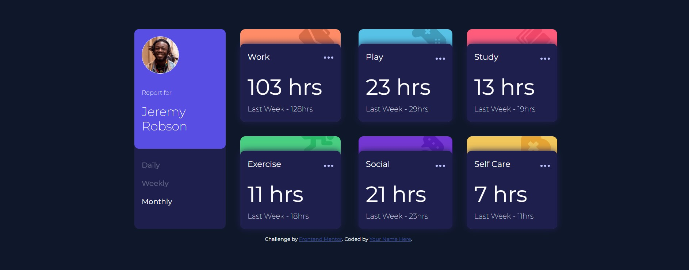

# Frontend Mentor - Time tracking dashboard solution

This is a solution to the [Time tracking dashboard challenge on Frontend Mentor](https://www.frontendmentor.io/challenges/time-tracking-dashboard-UIQ7167Jw). Frontend Mentor challenges help you improve your coding skills by building realistic projects. 

## Table of contents

- [Frontend Mentor - Time tracking dashboard solution](#frontend-mentor---time-tracking-dashboard-solution)
  - [Table of contents](#table-of-contents)
  - [Overview](#overview)
    - [The challenge](#the-challenge)
    - [Screenshot](#screenshot)
    - [Links](#links)
  - [My process](#my-process)
    - [Built with](#built-with)
    - [What I learned](#what-i-learned)
    - [Continued development](#continued-development)
    - [Useful resources](#useful-resources)
  - [Author](#author)
  - [Acknowledgments](#acknowledgments)


## Overview

### The challenge

Users should be able to:

- View the optimal layout for the site depending on their device's screen size
- See hover states for all interactive elements on the page
- Switch between viewing Daily, Weekly, and Monthly stats

### Screenshot



### Links

- Solution URL: [time-tracking-dashboard-main](https://github.com/malhar016/time-tracking-dashboard-main)
- Live Site URL: [frontend-metor-time-tracking-dashboad.netlify.app](https://frontend-metor-time-tracking-dashboad.netlify.app/)

## My process

### Built with

- Semantic HTML5 markup
- CSS custom properties
- Flexbox
- CSS Grid
- [React](https://reactjs.org/) - JS library

### What I learned

Modularizing the UI small components made the rest of the part very smooth. As this was simple App I manged the state between two child component by keeping state at parent level and drilled it in both children. In ideal world we can think of context api or Recoil for better state management.

Also, use of css grid, media query and styling SVGs was some of my weak areas so I am glad I could practice with this. 

_(**declaimer**: I couldn't place the background SVGs dynamically as each one needed different positions so checked some submitted gits and took reference of their styling.)_

So, point being don't put so much time in something trivial, move on there is so much to learn and accomplish

```css
#work {
  background-color: var(--work-background-color);
  background-image: url(/public/images/icon-work.svg);
  background-position: 90% -12%;
}

#play {
  background-color: var(--play-background-color);
  background-image: url(/public/images/icon-play.svg);
  background-position: 90% -12%;
}
```
```js
function TimeFrame({ option, selected, setSelected }) {
  return (
    <a
      className={option === selected ? "selected" : "non-selected"}
      onClick={() => setSelected(option)}
    >
      {option}
    </a>
  );
}
```

### Continued development

More and more frontend projects.

### Useful resources

- [Complete guide to css media queries](https://css-tricks.com/a-complete-guide-to-css-media-queries/) - I still need to finish the whole concept and want to practice it (given that bootstrap and other css libraries cover these things out-of-the-box never really got to get my hand on this really too much).
- [The Odin Project](https://www.theodinproject.com/) - The FrontendMentor with The Odin Project turning out to be deadly combo for me, learn-practice-learn.


## Author

- Website - [Malhar Bhuptani](https://portfolio-of-malhar.netlify.app/)
- Frontend Mentor - [@malhar016](https://www.frontendmentor.io/profile/malhar016)
- Twitter - [@Malhar016](https://x.com/Malhar016)

## Acknowledgments

@https://github.com/xkeshav: For being my 'css guru' and showing the real way of learning and practicing it.
